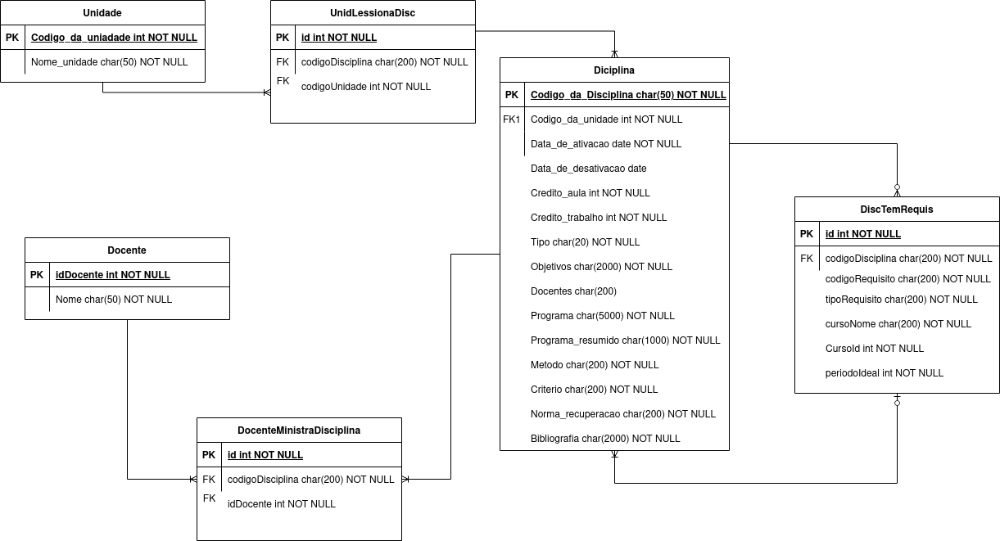

# Extrator de dados do jupiterweb

## SQLite Mode

O programa é constituido de dois arquivos:
- O **dbmanager** que é onde reside a classe de gestao do banco de dados, onde estao implementadas as funçoes de criação de tabelas e de inserção de conteudo no bd.
- O **extractor_db** que é onde reside a classe motor que executa o crawling sobre o jupiterweb e faz a busca pelas informaçoes de:
  - Disciplinas oferecida por unidade
  - Dados basicos sobre a disciplina (Os mesmos oferecidos no jsonMode)
  - Dados sobre os requisitos das disciplinas

Os dados estão organizados em um banco de dados SQLite versao 3 no formato representado no diagrama tipo MER:

## Json Mode

O programa é composto de dois arquivos:
- Um constando apenas de classes complementares que representam as **unidades** e as **disciplinas**
- Outro que executa o processo de extração dos dados do jupiterweb

Em essência o programa faz um get para a pagina do jupiterweb que contem a [lista das unidades](https://uspdigital.usp.br/jupiterweb/jupColegiadoLista?tipo=T), onde extra quais sao as unidades ativas e algumas informçoes sovre elas (nome e código da disciplina).

A partir da informação, extrai-se quais as disciplinas são ministradas e, em caso de encerradas, foram ministradas pelas unidades.
Destas disciplinas existem as informaçoes basicas (Codigo, nome, data de ativação e desativação) e informaçoes complementares, que podem ser obrigatorias ou não (Creditos, Metodo, Docente, Tipo de recuperação, etc)

No codigo principal existe um método toJson que importa os dados extraidos relativo a cada unidade e suas disciplinas para um arquivo no formato Json.

O formato do arquivo Json é:

{ 
  &nbsp;<em>codigo_da_unidade</em>: { 
    &nbsp; &nbsp;**nome**: "nome da unidade", 
    &nbsp; &nbsp;**code**: "codigo_da_unidade", 
    &nbsp; &nbsp;**disciplinas**: { 
      &nbsp; &nbsp; &nbsp;<em>codigo_da_disciplina</em>: { 
          &nbsp; &nbsp; &nbsp; &nbsp; &nbsp; **nome**: "nome_da_disciplina", 
          &nbsp; &nbsp; &nbsp; &nbsp; &nbsp; **codigo**: "codigo_da_disciplina", 
          &nbsp; &nbsp; &nbsp; &nbsp; &nbsp; **ativacao**: "data_de_ativacao", 
          &nbsp; &nbsp; &nbsp; &nbsp; &nbsp; **desativacao**: "data_de_desativacao", 
          &nbsp; &nbsp; &nbsp; &nbsp; &nbsp; **credito_aula**: "numero_de_creditos", 
          &nbsp; &nbsp; &nbsp; &nbsp; &nbsp; **credito_trabalho**: "numero_de_creditos", 
          &nbsp; &nbsp; &nbsp; &nbsp; &nbsp; **tipo**: "semestral/anual", 
          &nbsp; &nbsp; &nbsp; &nbsp; &nbsp; **objetivos**: "objetivos_da_disciplina", 
          &nbsp; &nbsp; &nbsp; &nbsp; &nbsp; **docentes**: "docentes", 
          &nbsp; &nbsp; &nbsp; &nbsp; &nbsp; **programa**: "programa_da_disciplina", 
          &nbsp; &nbsp; &nbsp; &nbsp; &nbsp; **programa_resumido**: "programa_resumido_da_disciplina", 
          &nbsp; &nbsp; &nbsp; &nbsp; &nbsp; **metodo**: "metodo_de_avaliacao", 
          &nbsp; &nbsp; &nbsp; &nbsp; &nbsp; **criterio**: "criterio_de_aprovacao", 
          &nbsp; &nbsp; &nbsp; &nbsp; &nbsp; **norma_de_recuperacao**: "tipo_de_recuperacao", 
          &nbsp; &nbsp; &nbsp; &nbsp; &nbsp; **bibliografia**: "bibliografia_da_disciplina" 
      &nbsp; &nbsp; }, 
      &nbsp; &nbsp; #Outras_disciplinas_da_unidade#  
    &nbsp; &nbsp; } 
  &nbsp; }, 
  &nbsp; #outras_unidades# 
}

Consta no repositório um arquivo extraído do jupiterweb no dia 02/12/2021 como exemplo.
Lembrando que eventuais mudanças de layout no jupiterweb podem interferir no desempenho e bom funcionamento do algoritmo, ja que os dados são obtidos por meio de web scrapping e web crawling.
